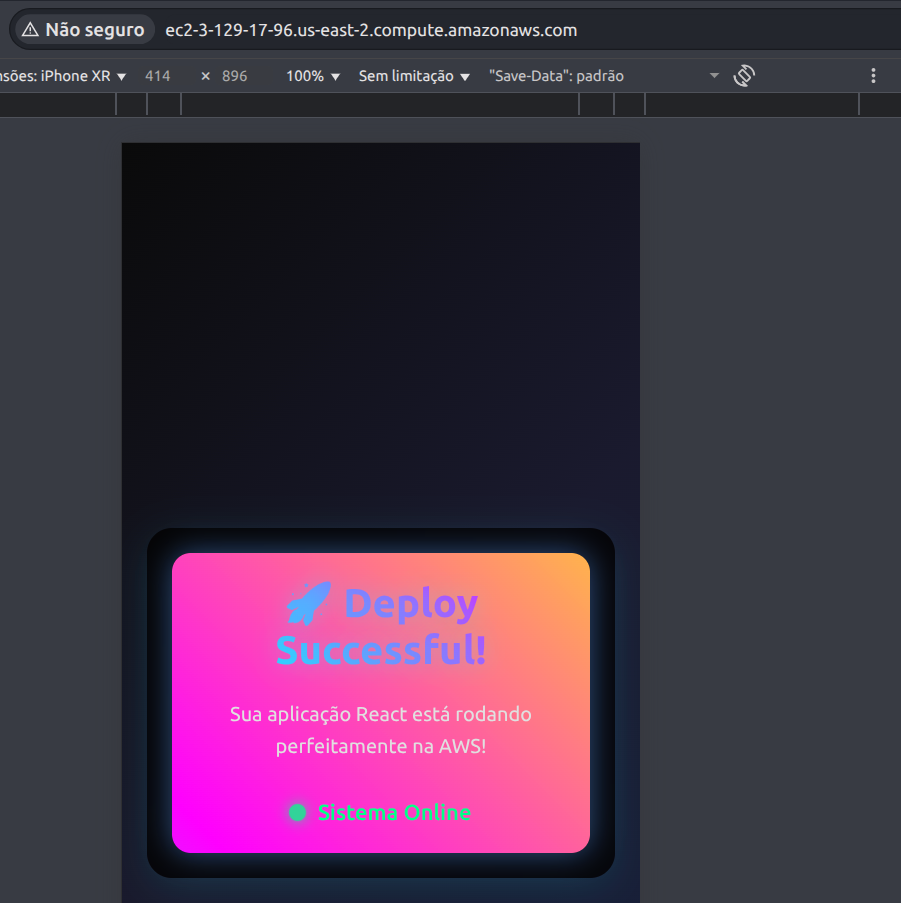

# AWS Deploy App

Aplicação React simples para aprender deploy na AWS.



## Estrutura

```
/app - Aplicação React com TypeScript
Dockerfile - Container para produção
nginx.conf - Configuração do servidor web
```

## Desenvolvimento Local

```bash
cd app
npm install
npm start
```

## Build Docker

```bash
docker build -t aws-deploy-app .
docker run -it -p 3000:80 aws-deploy-app
```

## Deploy na AWS

Esta aplicação está pronta para deploy em:
- AWS ECS
- AWS App Runner  
- AWS Elastic Beanstalk
- AWS EC2 com Docker